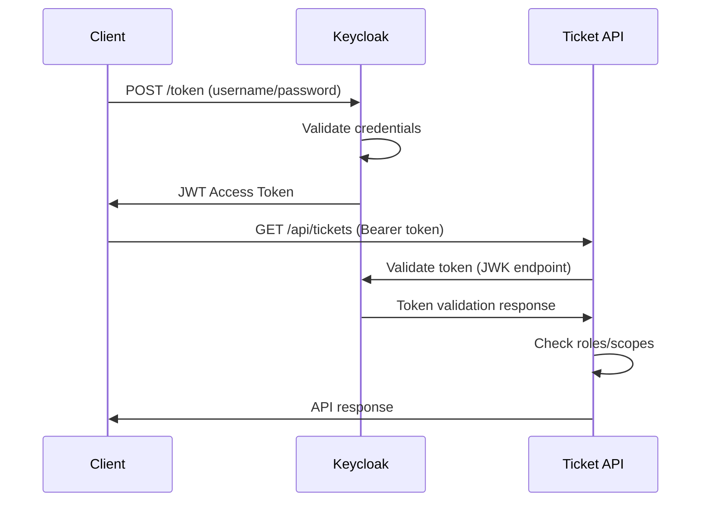

# Spring Boot 3.x OAuth2 Ticket Management Demo

A comprehensive demonstration of OAuth2 authentication and authorization using Spring Boot 3.x, Spring Security 6, and Keycloak as the Identity Provider.

## 🎯 Project Overview

This project demonstrates a complete OAuth2 implementation with:
- **Ticket Management API** - CRUD operations for event tickets
- **Role-based Authorization** - User and Admin access levels
- **OAuth2 Resource Server** - JWT token validation
- **Keycloak Identity Provider** - Complete OAuth2 authorization server
- **Docker Containerization** - Easy deployment and testing

## 🏗️ Architecture

```
┌─────────────────┐    ┌─────────────────┐    ┌─────────────────┐
│                 │    │                 │    │                 │
│   Client App    │◄──►│   Keycloak      │◄──►│  Ticket API     │
│                 │    │ (Auth Server)   │    │ (Resource       │
│                 │    │                 │    │  Server)        │
└─────────────────┘    └─────────────────┘    └─────────────────┘
         │                       │                       │
         │                       │                       │
         ▼                       ▼                       ▼
   Web Browser              JWT Tokens             H2 Database
```

## 🚀 Quick Start

### Prerequisites
- Java 17 or higher
- Maven 3.6+
- Docker & Docker Compose

### Running with Docker (Recommended)

1. **Clone and build:**
   ```bash
   git clone <repository-url>
   cd spring6-oauth2
   ./run-docker.sh
   ```

2. **Access the applications:**
   - **Keycloak Admin**: http://localhost:9090 (admin/admin123)
   - **Ticket API**: http://localhost:8080
   - **H2 Console**: http://localhost:8080/h2-console

3. **Test the API:**
   ```bash
   ./test-api.sh
   ```

### Manual Setup

1. **Start Keycloak:**
   ```bash
   docker-compose up keycloak -d
   ```

2. **Build and run the API:**
   ```bash
   ./build.sh
   java -jar target/ticket-oauth2-demo-1.0.0.jar
   ```

## 🔐 OAuth2 Authentication Flow

### Understanding OAuth2 in This Demo

This project implements the **OAuth2 Resource Server** pattern with **JWT tokens**:

1. **Client** requests access token from Keycloak
2. **Keycloak** validates credentials and issues JWT token
3. **Client** includes JWT token in API requests
4. **Ticket API** validates JWT token with Keycloak's public keys
5. **API** authorizes requests based on token claims and roles

### Authentication Process



## 🎟️ API Endpoints

### Authentication Required Endpoints

| Method | Endpoint | Role Required | Description |
|--------|----------|---------------|-------------|
| GET | `/api/tickets` | USER, ADMIN | List all tickets |
| GET | `/api/tickets/{id}` | USER, ADMIN | Get ticket by ID |
| POST | `/api/tickets` | USER, ADMIN | Create new ticket |
| PUT | `/api/tickets/{id}` | USER, ADMIN | Update ticket |
| DELETE | `/api/tickets/{id}` | ADMIN | Delete ticket |
| GET | `/api/tickets/me` | USER, ADMIN | Get current user info |

### Ticket Model

```json
{
  "id": 1,
  "date": "2024-12-25T19:30:00",
  "price": 85.50,
  "ownerName": "John Doe",
  "showTitle": "Hamilton",
  "venue": "Broadway Theater",
  "createdAt": "2024-01-15T10:30:00",
  "updatedAt": "2024-01-15T10:30:00"
}
```

## 🔑 Getting Access Tokens

### Using cURL

```bash
# Get access token
TOKEN=$(curl -s -X POST \
  "http://localhost:9090/realms/ticket-realm/protocol/openid-connect/token" \
  -H "Content-Type: application/x-www-form-urlencoded" \
  -d "grant_type=password" \
  -d "client_id=ticket-client" \
  -d "username=user1" \
  -d "password=password123" | \
  jq -r .access_token)

# Use token in API call
curl -H "Authorization: Bearer $TOKEN" \
  "http://localhost:8080/api/tickets"
```

### Using Postman

1. **Get Token:**
   - Method: POST
   - URL: `http://localhost:9090/realms/ticket-realm/protocol/openid-connect/token`
   - Body (form-urlencoded):
     - `grant_type`: password
     - `client_id`: ticket-client
     - `username`: user1
     - `password`: password123

2. **Use Token:**
   - Add to request headers: `Authorization: Bearer {access_token}`

## 👥 Test Users

### Pre-configured Users

| Username | Password | Roles | Description |
|----------|----------|-------|-------------|
| user1 | password123 | USER | Can read/create/update tickets |
| admin1 | admin123 | ADMIN, USER | Can perform all operations including delete |

## 🔧 Configuration Details

### Security Configuration

The application uses **method-level security** with role-based access control:

```java
@PreAuthorize("hasRole('USER') or hasRole('ADMIN')")  // Read/Write operations
@PreAuthorize("hasRole('ADMIN')")                     // Delete operations
```

### JWT Token Validation

- **Issuer**: `http://localhost:9090/realms/ticket-realm`
- **JWK Set**: `http://localhost:9090/realms/ticket-realm/protocol/openid-connect/certs`
- **Algorithm**: RS256 (RSA with SHA-256)

### Role Extraction

Roles are extracted from JWT claims:
- **Scope claims**: Direct OAuth2 scopes
- **Realm roles**: Keycloak realm-level roles (prefixed with `ROLE_`)

## 🐳 Docker Configuration

### Services

- **keycloak**: OAuth2/OIDC Identity Provider (port 9090)
- **ticket-api**: Spring Boot application (port 8080)

### Networking

Both services run in a custom Docker network (`ticket-network`) for secure communication.

### Health Checks

Both containers include health checks to ensure proper startup order.

## 🧪 Testing

### Automated Testing

Run the included test script:
```bash
./test-api.sh
```

This script tests:
- Token acquisition for both USER and ADMIN
- All CRUD operations with proper authorization
- Access control verification (USER cannot delete)

### Manual Testing Scenarios

1. **Successful Authentication:**
   - Valid user credentials → receive access token
   - Use token → access protected resources

2. **Authorization Levels:**
   - USER role → can read/create/update
   - ADMIN role → can delete

3. **Token Expiration:**
   - Wait 5 minutes → token expires
   - Use expired token → receive 401 Unauthorized

4. **Invalid Credentials:**
   - Wrong username/password → authentication fails
   - No token → receive 401 Unauthorized

## 🔍 Troubleshooting

### Common Issues

1. **Keycloak not ready:**
   ```bash
   # Check Keycloak status
   curl http://localhost:9090/health/ready
   ```

2. **Token validation fails:**
   - Verify issuer URI in application.yml
   - Check network connectivity between services

3. **Role authorization fails:**
   - Verify user roles in Keycloak admin console
   - Check JWT token claims: `jwt.io`

### Useful Commands

```bash
# View logs
docker-compose logs -f

# Restart services
docker-compose restart

# Clean restart
docker-compose down && docker-compose up --build

# Check JWT token claims
echo $TOKEN | cut -d. -f2 | base64 -d | jq
```

## 📚 Learning Resources

### OAuth2 Concepts Demonstrated

1. **Resource Server Pattern**: API validates tokens but doesn't issue them
2. **JWT Tokens**: Self-contained tokens with claims
3. **Role-based Authorization**: Different access levels
4. **Token Introspection**: Validating tokens with identity provider

### Key Components Explained

- **SecurityConfig.java**: Configures OAuth2 resource server and role extraction
- **JwtAuthenticationConverter**: Converts JWT claims to Spring Security authorities
- **@PreAuthorize**: Method-level security annotations
- **Keycloak Realm**: Complete OAuth2/OIDC configuration

## 🤝 Contributing

1. Fork the repository
2. Create a feature branch
3. Add tests for new functionality
4. Ensure all tests pass
5. Submit a pull request

## 📄 License

This project is licensed under the MIT License - see the LICENSE file for details.

---

**Happy coding! 🚀**

For questions or issues, please check the troubleshooting section or create an issue in the repository.